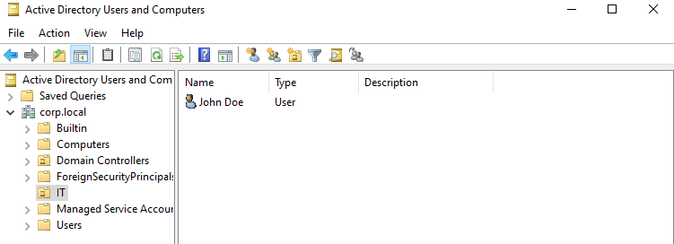
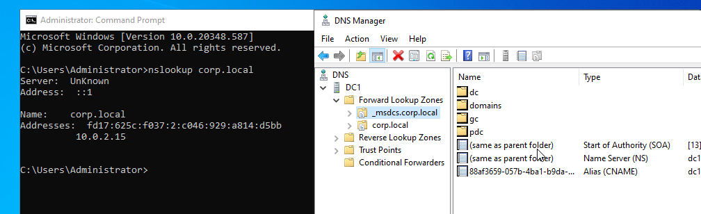

# windows-server-active-directory-lab

# Windows Server Active Directory Home Lab (VirtualBox)

## Overview
This project demonstrates a full Windows Server 2022 Active Directory environment built in a VirtualBox virtual lab. It includes domain configuration, DNS, DHCP, and user management.

---

## 🖥️ Environment

- Windows Server 2022 (Domain Controller)

- VirtualBox

- Domain: corp.local

- Server Name: DC1

---

## ⚙️ Configurations Completed

### Active Directory Domain Services (AD DS)
- Installed and configured Domain Controller
- Created new forest: corp.local
- Promoted server to domain controller

### DNS Configuration
- Configured DNS role
- Verified forward lookup zone for corp.local
- Tested name resolution using nslookup

### DHCP Configuration
- Created DHCP scope: LAN Scope
- IP Range: 192.168.10.100 – 192.168.10.200
- Configured gateway and DNS options
- Activated scope successfully

### User Management
- Created Organizational Unit: IT
- Created user account: john.doe
- Managed users within Active Directory

---

## 📷 Screenshots
Active Directory OU and User Account Creation 

DNS Forward Lookup Zone (corp.local) Verification

DHCP Scope Configuration (192.168.10.100–200)

